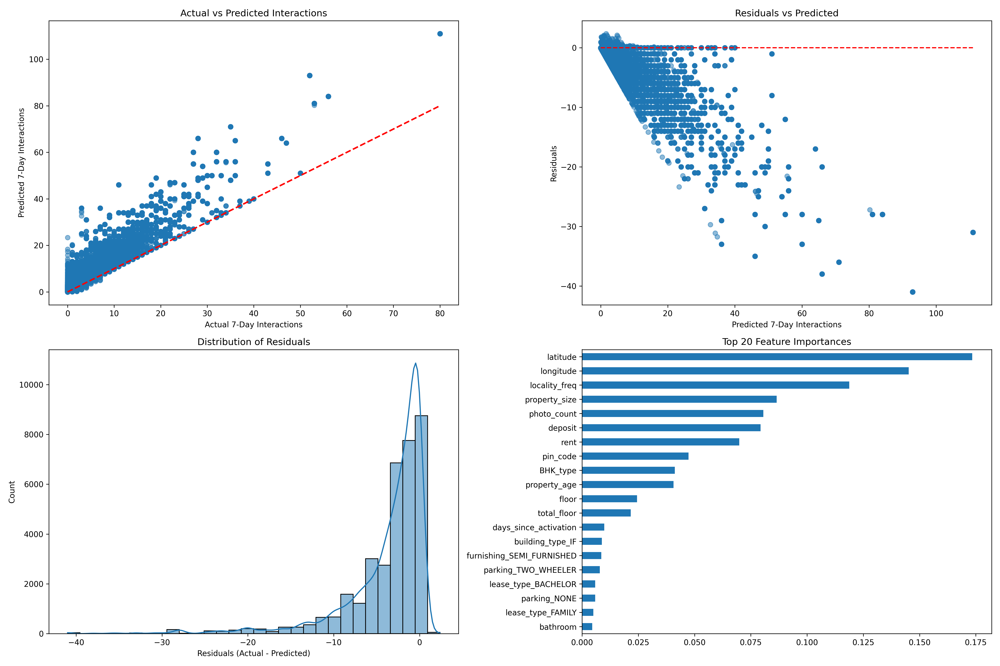

# 🏡 Predicting Property Listing Interactions (3-Day and 7-Day)

## Overview
This project builds predictive models to estimate how many user interactions (views, saves, inquiries) a property listing will receive over 3 days and 7 days.

We used **Random Forest** and **LightGBM** to predict interactions based on features like property size, rent price, number of photos, and locality popularity.

Achieved **R² = 0.995** for 7-day predictions!

---

## Project Structure
- 📊 **Feature Engineering:** Handling missing data, encoding categorical variables, creating new features like price per sqft and property age.
- 🛠️ **Model Building:** Training RandomForest and LightGBM regressors.
- 📈 **Model Evaluation:** Visual dashboard showing Actual vs Predicted, Residuals, Error Distribution, and Feature Importance.
- 🌎 **Deployment Ready:** Saved trained models for easy future predictions.

---

## Key Results
| Metric | Random Forest (7-Day Prediction) |
|:-------|:-------------------------------|
| MAE | 0.24 |
| RMSE | 0.77 |
| R² Score | 0.995 |

✅ Extremely strong predictive performance!

---

## Visuals



---

## Tools Used
- Python (Pandas, Scikit-learn, LightGBM, Seaborn, Matplotlib)
- Jupyter Notebook
- Streamlit (for simple app, optional)
- SHAP (for model explainability)

---

## Run Locally
1. Clone the repo
2. Install dependencies:  
   ```bash
   pip install -r requirements.txt
